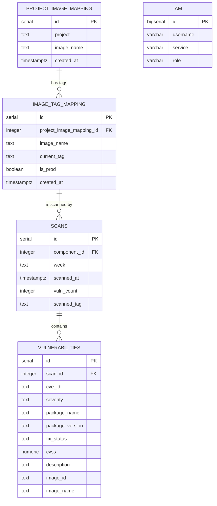

```mermaid

erDiagram
    PROJECT_IMAGE_MAPPING ||--o{ IMAGE_TAG_MAPPING : "has tags"
    IMAGE_TAG_MAPPING ||--o{ SCANS : "is scanned by"
    SCANS ||--o{ VULNERABILITIES : "contains"

    PROJECT_IMAGE_MAPPING {
        serial id PK
        text project
        text image_name
        timestamptz created_at
    }

    IMAGE_TAG_MAPPING {
        serial id PK
        integer project_image_mapping_id FK
        text image_name
        text current_tag
        boolean is_prod
        timestamptz created_at
    }

    SCANS {
        serial id PK
        integer component_id FK
        text week
        timestamptz scanned_at
        integer vuln_count
        text scanned_tag
    }

    VULNERABILITIES {
        serial id PK
        integer scan_id FK
        text cve_id
        text severity
        text package_name
        text package_version
        text fix_status
        numeric cvss
        text description
        text image_id
        text image_name
    }

    IAM {
        bigserial id PK
        varchar username
        varchar service
        varchar role
    }

```