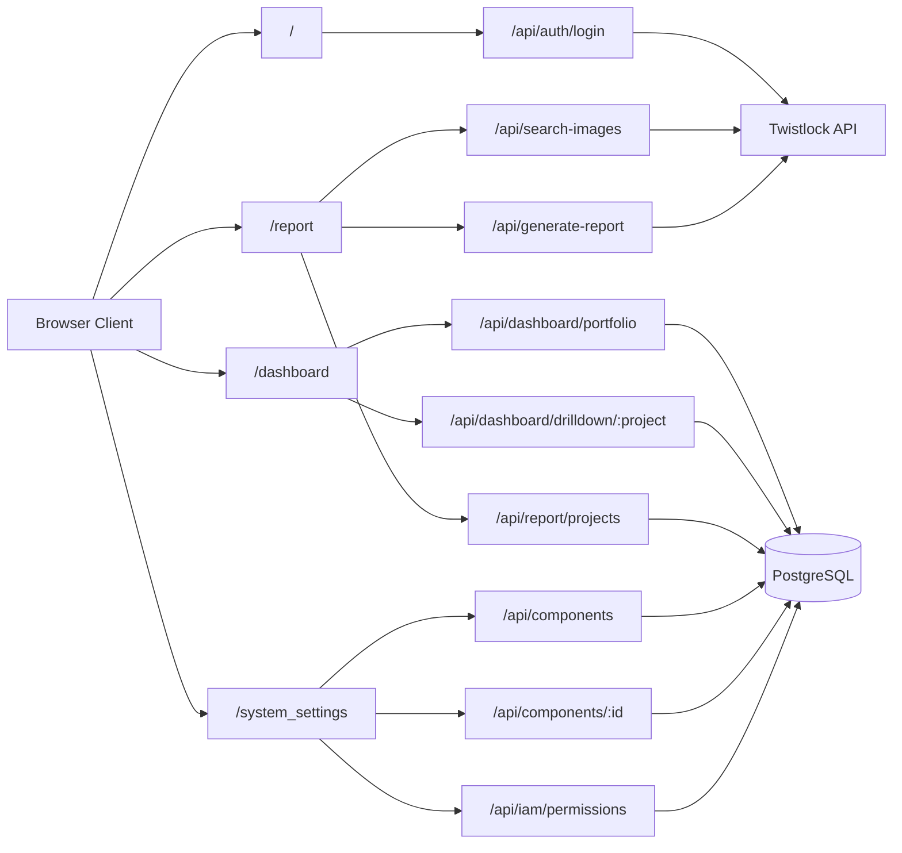
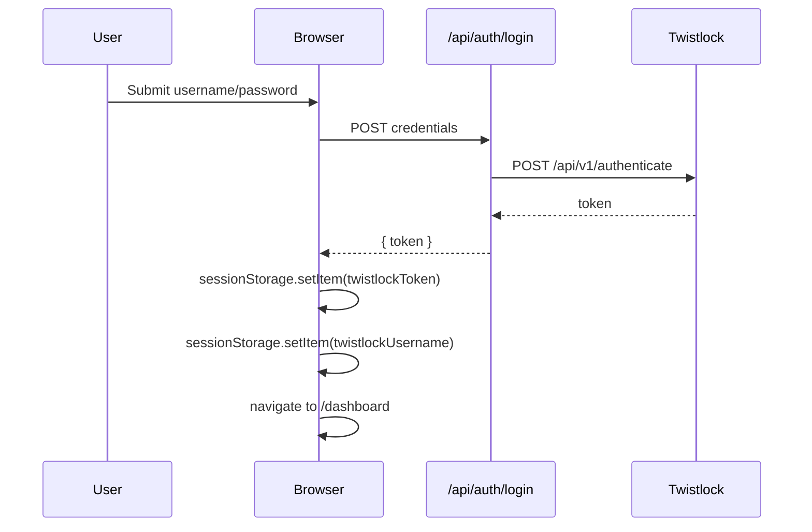
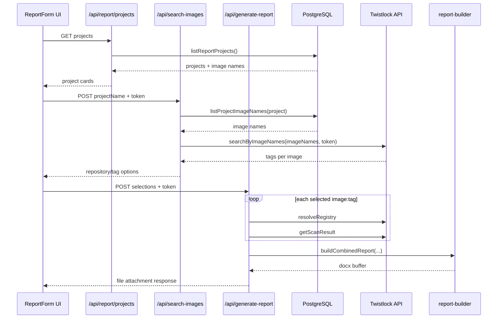
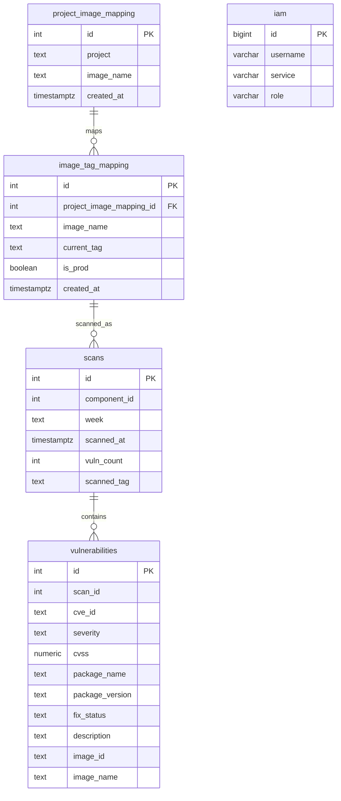
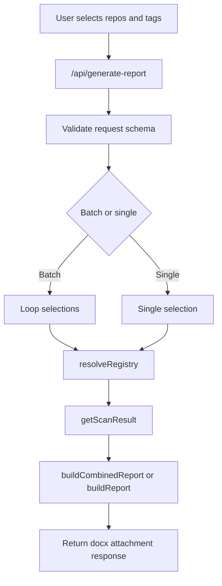
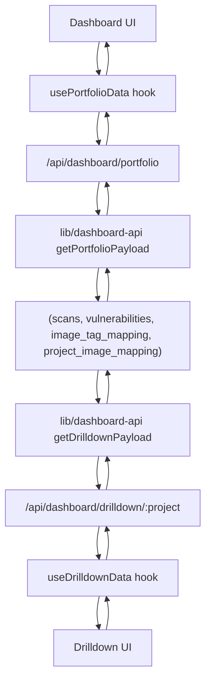

# System Design - Twistlock Report and Vulnerability Dashboard

Version: 3.0  
Date: 2026-05-26  
Status: Implemented (matches current codebase)

## 1. Scope

This document describes the system currently implemented in this repository:

- Twistlock username/password login
- Session-protected dashboard and drilldown views
- Report generation workflow backed by project-image mapping tables
- System settings CRUD for project/image/tag mapping
- IAM-based UI action gating for create, update, and delete in system settings

## 2. Architecture Overview

The app is a Next.js 16 App Router application that serves UI pages and API routes from the same deployment unit.

## 3. Runtime and Deployment Model

- Framework: Next.js 16.1.6 + React 19.2.3
- Language: TypeScript
- Styling: Tailwind CSS + shadcn/ui primitives
- Database access: `pg` Pool via server-side `lib/db.ts`
- Report output: `.docx` generated with `docxtemplater` + `pizzip`
- API execution mode: Node.js runtime for server routes that touch DB, filesystem, or heavy logic

## 4. Frontend Route Map

Implemented page routes:

- `/` login and product entry
- `/docs` usage guide
- `/dashboard` portfolio view
- `/dashboard/drilldown/[project]` project drilldown
- `/report` project selection for report generation
- `/report/find-repository` report form with optional pre-selected project
- `/report/generate` report form with auto-search on mount
- `/system_settings` mapping administration page
- `/logout` clears session and redirects to `/`

## 5. Session and Authentication Design

Authentication flow uses Twistlock credentials and stores the returned token in browser `sessionStorage`.

- Token key: `twistlockToken`
- Username key: `twistlockUsername`
- Session guard: `useSessionAuth` redirects to `/` when token is missing

## 6. API Surface

### 6.1 Twistlock Proxy APIs

- `POST /api/auth/login`
  - Validates login payload with Zod
  - Calls `authenticate` in `lib/twistlock.ts`

- `POST /api/search-images`
  - Input: `{ projectName, twistlockToken }`
  - Resolves project image list from DB via `listProjectImageNames`
  - Calls Twistlock registry search by image name via `searchByImageNames`

- `POST /api/generate-report`
  - Supports single-image and batch payloads
  - For each selection: `resolveRegistry` then `getScanResult`
  - Generates `.docx` in-memory and streams as file response

### 6.2 Dashboard APIs

- `GET /api/dashboard/portfolio`
  - Query: `week`, `sortBy`, `hasIssuesOnly`
  - Returns week, trend weeks, and per-project severity counts + trend array

- `GET /api/dashboard/drilldown/[project]`
  - Query: `week`, `severities`, `component`, `fixStatus`, `q`, `page`, `pageSize`
  - Returns totals, trend detail, filter options, paginated rows, and pagination metadata

### 6.3 Report and Settings APIs

- `GET /api/report/projects`
  - Returns project list from mapping tables

- `GET /api/components`
- `POST /api/components`
- `POST /api/components/by-image`
- `PATCH /api/components/[id]`
- `DELETE /api/components/[id]`
  - CRUD on project-image-tag mapping data via `lib/components-api.ts`

- `POST /api/components/by-image`
  - Input: `{ imageName, currentTag, isProd? }`
  - Finds an existing `image_tag_mapping` record by `image_name`
  - If no record exists for `imageName`, returns 404
  - Reuses the matched row's `project_image_mapping_id` to insert a new `image_tag_mapping` row
  - Writes `created_at` using server timestamp (`CURRENT_TIMESTAMP`)
  - Returns 409 if `(project_image_mapping_id, current_tag)` already exists

- `GET /api/iam/permissions`
  - Query: `username`, `service`
  - Returns `{ canCreate, canUpdate, canDelete }`

- `GET /api/ping`
  - Health endpoint

## 6A. Implementation - Twistlock Report

This section maps the implemented Twistlock Report feature end to end.

### UI implementation

- Entry page and login handoff: `app/page.tsx`, `components/LoginForm.tsx`
- Report project selection page: `app/report/page.tsx`
- Report generation pages: `app/report/find-repository/page.tsx`, `app/report/generate/page.tsx`
- Main report interaction component: `components/ReportForm.tsx`

### Server implementation

- Login route: `app/api/auth/login/route.ts`
- Project list route (DB-backed): `app/api/report/projects/route.ts`
- Image search route: `app/api/search-images/route.ts`
- Report generation route: `app/api/generate-report/route.ts`

### Domain/service modules

- Twistlock client: `lib/twistlock.ts`
- Report builder and template rendering: `lib/report-builder.ts`
- Project-to-image mapping lookup: `lib/report-projects.ts`
- Input schemas: `lib/validators.ts`

### Implementation flow

## 7. ER Diagram and Database Design

### 7.1 ER Diagram

### 7.2 Logical Design

- `project_image_mapping` is the canonical project-to-image table with uniqueness on `(project, image_name)`.
- `image_tag_mapping` stores tags for each mapped image and supports multiple tags per image via `(project_image_mapping_id, current_tag)` uniqueness.
- `scans` stores periodic snapshots keyed by `week` and `component_id`.
- `vulnerabilities` stores per-scan findings keyed by `scan_id`.
- `iam` stores per-user per-service role strings used to derive CRUD permissions.

### 7.3 Keys and Constraints

- Primary keys:
  - `project_image_mapping.id`
  - `image_tag_mapping.id`
  - `scans.id`
  - `vulnerabilities.id`
  - `iam.id`
- Unique constraints:
  - `project_image_mapping (project, image_name)`
  - `image_tag_mapping (project_image_mapping_id, current_tag)`
- Foreign keys:
  - Enforced: `image_tag_mapping.project_image_mapping_id -> project_image_mapping.id`
  - Logical/expected by query model:
    - `scans.component_id -> image_tag_mapping.id`
    - `vulnerabilities.scan_id -> scans.id`

### 7.4 Query-Oriented Indexing Strategy

To support current dashboard and report workloads, keep these indexes in place (or add if missing):

- `scans (week, component_id, scanned_at DESC)` for latest-scan-per-component queries.
- `vulnerabilities (scan_id, severity, cve_id)` for drilldown filters and dedupe.
- `project_image_mapping (project, image_name)` backed by the unique constraint.
- `image_tag_mapping (project_image_mapping_id, current_tag)` backed by the unique constraint.
- `iam (LOWER(username), LOWER(service))` for permission lookup endpoint behavior.

### 7.5 Database Design Notes for Current Implementation

- Dashboard queries intentionally deduplicate by component and CVE to avoid over-counting across repeated scan rows.
- Components/system settings writes demote prior production tags when setting a new `is_prod=true` mapping row.
- Migration scripts preserve historical IDs and reset sequences using `setval(...)` after backfill.

## 8. Report Generation Pipeline

`lib/report-builder.ts` fills `lib/template.docx` with scan data.

- Normalizes potentially broken split placeholders in the Word XML
- Injects loop markers for microservice rows in combined mode
- Sorts vulnerabilities by severity order: critical, high, medium, low
- Produces a single combined document for selected repositories

## 9. Dashboard and Drilldown Processing

Portfolio and drilldown both read from PostgreSQL and return UI-friendly payloads.

- Portfolio:
  - latest available week fallback when week is omitted
  - severity counts per project
  - 8-week trend generation
  - sorting and has-issues filtering

- Drilldown:
  - resolves canonical project from slug
  - totals by severity
  - 8-week severity trend detail
  - component/fix-status filter options
  - search + pagination on deduped vulnerability rows

## 9A. Implementation - Vulnerability Dashboard

This section maps the implemented dashboard feature from UI to SQL-backed aggregation.

### UI implementation

- Portfolio page shell: `app/dashboard/page.tsx`
- Portfolio table and sparkline UI: `app/dashboard/_components/PortfolioOverviewDesign.tsx`
- Drilldown page shell: `app/dashboard/drilldown/[project]/page.tsx`
- Drilldown analytics UI: `app/dashboard/_components/ProjectDrilldownDesign.tsx`
- Dashboard client data hooks: `app/dashboard/_hooks/useDashboardApi.ts`

### Server implementation

- Portfolio API: `app/api/dashboard/portfolio/route.ts`
- Drilldown API: `app/api/dashboard/drilldown/[project]/route.ts`
- Query and aggregation logic: `lib/dashboard-api.ts`

### Data/aggregation behavior implemented

- Resolves latest available week when week is omitted
- Uses latest scan per component for a given week
- Deduplicates vulnerability rows by component and CVE key patterns
- Produces severity totals and 8-week trend payloads
- Supports drilldown filters for severity, component, fix status, text search, and pagination

### Implementation flow

## 10. Security and Operational Design

- Credentials are exchanged only through server route `POST /api/auth/login`
- Twistlock token and username are client session-scoped (`sessionStorage`)
- Token is not persisted in DB by application logic
- DB access is server-side only through pooled connections
- API input validation uses Zod on request boundaries
- Runtime errors are mapped to user-facing JSON errors and HTTP status codes

## 11. CLI Batch Reporting

The script `scripts/generate-reports.ts` supports non-UI report generation:

- Optional project filtering via `--projects`
- Reads config from `projects.config.json`
- Authenticates once and generates per-project combined reports
- Writes outputs under `reports/YYYY-MM-DD/`

## 12. Known Implementation Constraints

- `useSessionAuth` currently assumes token presence in session storage and redirects when missing.
- Report generation route performs sequential Twistlock fetches per selected image/tag.
- Dashboard data quality depends on weekly scan ingestion consistency in DB tables.
- System settings permissions are client-evaluated for UI controls; server route authorization policy should remain enforced by backend logic and environment controls.

## 13. Summary

This implementation is a unified Next.js application with:

- Session-scoped Twistlock authentication
- DB-backed vulnerability analytics dashboard
- DB-backed report project mapping and administration
- In-memory `.docx` report generation from Twistlock scan data

The implementation is delivered as two primary product capabilities:

- Twistlock Report generation workflow
- Vulnerability Dashboard and project drilldown analytics workflow

All architecture and sequence diagrams in this document are Mermaid-based by design.